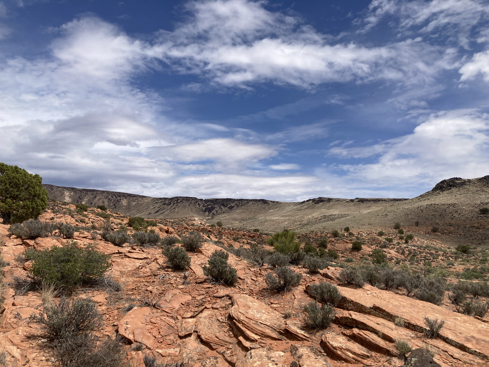
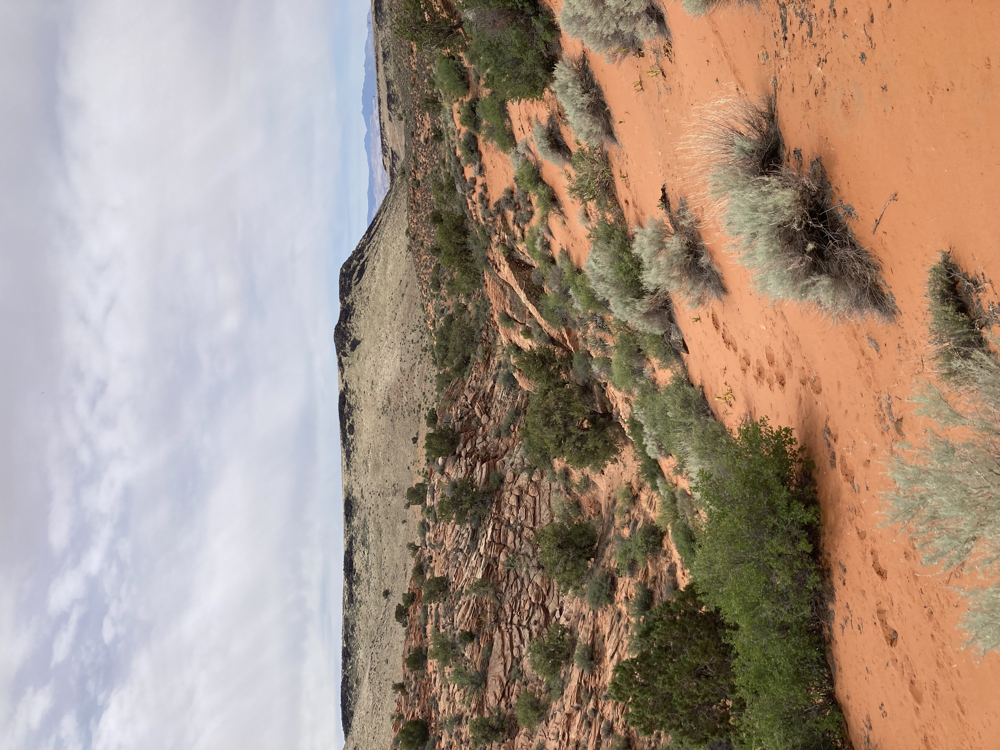
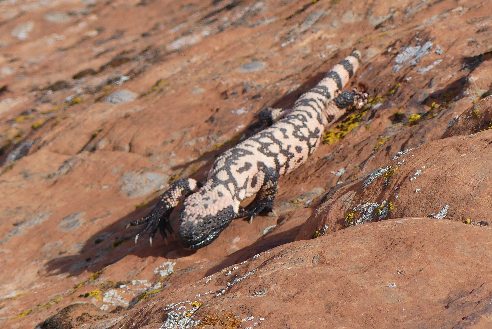
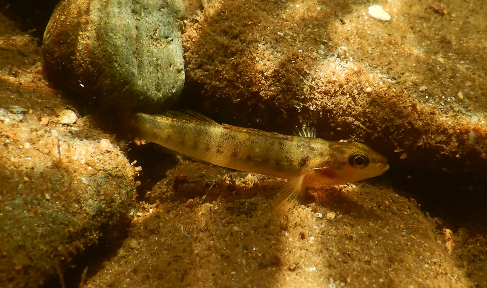

```{r setup, include=FALSE}

if (!require("pacman")) install.packages("pacman")
pacman::p_load(knitr)

knitr::opts_chunk$set(echo = F)
knitr::opts_chunk$set(warning = F)
knitr::opts_chunk$set(message = F)
```


<style>
body {text-align: left}
</style>

----------------------------------

## Ongoing

##

### **Niche Overlap of Gila Monsters and Beaded Lizards** <br>

### Project Overview

<div style="display: flex; align-items: center;">
  
  <p> I am currently working with Dr. Chris Gienger to determine if Gila Monsters and Beaded Lizards, the two last extant members of Genus *Heloderma*, show niche similarity where their ranges overlap in southern Sonora, Mexico. We will assess this by using occurrence data and environmental layers collected via satellite to develop ecological niche models for each species using the MaxEnt (maximum entropy) algorithm. We will then use various indeces and metrics to determine if these two closely related species show niche similarity or divergence. </p>
</div>

----------------------------------

## Thesis 

##
<!--adds space breaks-->
### **Distribution of Gila Monsters**<br> 

<div style="display: flex; justify-content: space-between;">
  
  
  
</div>

### Project Overview

As a graduate student at Austin Peay State University, I conducted my thesis research on developing a distribution of the Gila Monster (*Heloderma suspectum*) in order to assess how much of this distribution was located within protected natural areas (PNAs). The Gila Monster is a desert lizard currently state listed as threatened or endangered across its range. It is also highly cryptic, making it difficult to assess as a species using normal field techniques. I utilized georeferenced occurrence data and environmental layers collected via satellite to develop a species distribution model using the MaxEnt (maximum entropy) algorithm. This was then compared to a PNA database that included the United States Geological Survey's Gap Analysis Project (USA) and Protected Planet (Mexico) databases. The main aims of this research were to determine the climatic variables that shape their distribution, assess the degree of overlap between the distribution and PNA database, and identify possible novel potential habitats that may be critical for Gila Monsters.

----------------------------------

### Project Results

<div style="display: flex; align-items: center;">
  <div style="flex: 1;">
  <p>Our results showed that only a small percentage of high quality PNAs overlap with our predicted distribution for Gila Monsters. We identified several aspects of temperature and precipitation as the variables driving their distribution, which is unsurprising due to their desert habitat. We also identified portions of southeastern California and northwestern Chihuahua, Mexico, as potentially containing Gila Monster populations even though we have few to no confirmed records there. Our results have since been published in the Journal of Nature Conservation [here](https://www.sciencedirect.com/science/article/abs/pii/S1617138125001219). </p>
</div>
<div style="flex: 0;">

</div>
</div>

----------------------------------

## Other 

##
<!--adds space breaks-->
### **Gila Monster Occupancy Surveys**<br> 

<div style="display: flex; align-items: center;">
  
  <p> In the spring of 2025, I spent two weeks working as a voluntary field technician for other members of Dr. Chris Gienger's lab. Field work consisted of walking one kilometer-long transects across multiple study sites in the Mojave Desert looking for either individual animals or tracks as detections, collecting climate and habitat information along the way. These research projects were aimed at developing occupancy models for Gila Monsters in southern Nevada and southwestern Utah so we could determine possible conservation needs for this threatened species in these areas.</p>
</div>

----------------------------------

##
<!--adds space breaks-->
### **Citico Darter Surveys**<br> 

<div style="display: flex; align-items: center;">
  <div style="flex: 1;">
  <p> In July of 2024, I was a voluntary field technician for Spencer Trimpe's research out of [Dr. Rebecca Blanton Johansen's lab](https://sites.google.com/site/thejohansenfishlab/home?authuser=0) at Austin Peay State University. The study focuses on conservation and population genetic health of the endangered Citico Darter (*Etheostoma sitikuense*) in eastern Tennessee. Field work consisted of snorkeling surveys, darters were located by inverting submerged boulders used as cover, capturing via hand nets, then collecting fin clips for DNA analysis and body length measurements. This research was funded by Austin Peay State University, the Tennessee Wildlife Resource Agency via U.S. Fish & Wildlife section 6 funds, and the Great Smoky Mountains Conservation Association.</p>
</div>
<div style="flex: 0;">

</div>
</div>

----------------------------------

## Publications

<!-- <script type='text/javascript' src='https://d1bxh8uas1mnw7.cloudfront.net/assets/embed.js'></script> -->

##

**Gehman, C.S.**, and C. M. Gienger. 2025. Predicting the potential distribution of the Gila Monster and evaluating the extent of protected natural areas for conservation. _Journal of Nature Conservation_ 86(2025):126944.


