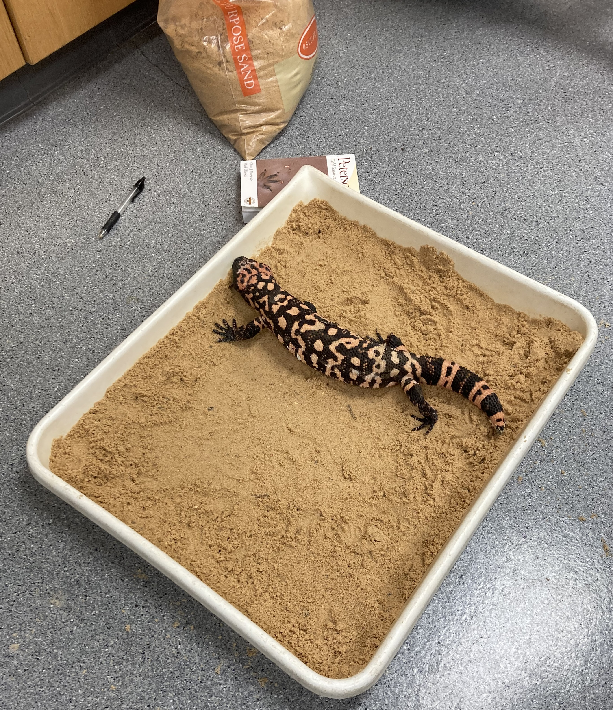
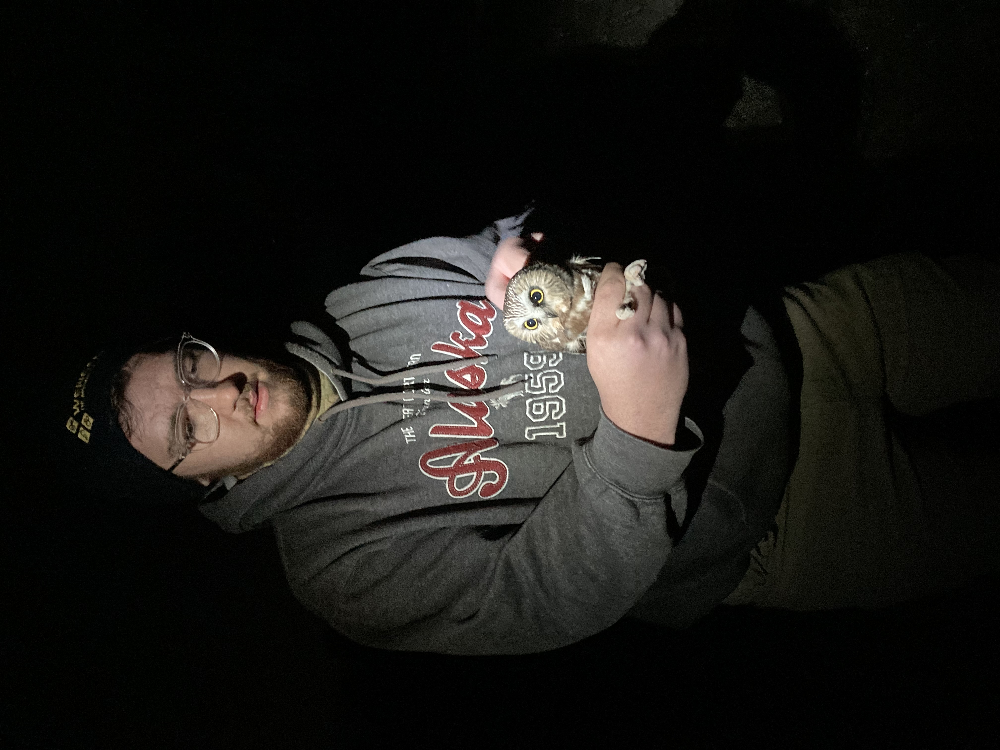
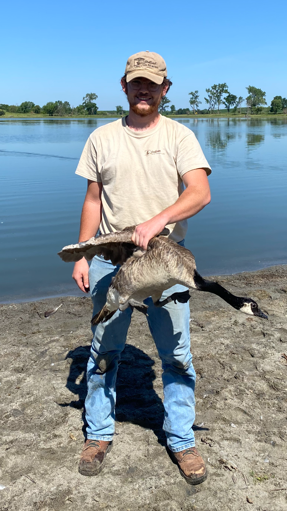

```{r setup, include=FALSE}
if (!require("pacman")) install.packages("pacman")
pacman::p_load(knitr)

knitr::opts_chunk$set(echo = TRUE)
knitr::opts_chunk$set(warning = F)
knitr::opts_chunk$set(message = F)
## For more inspiration on customizing the html output, refer to the following:
# https://bookdown.org/yihui/rmarkdown/html-document.html#table-of-contents
```


<style>
body {text-align: left}
</style>

----------------------------------

### Graduate Assistant

<div style="display: flex; align-items: center;">
  <div style="flex: 1;">
  <p>From August 2023 to May 2025, I served as both a graduate research assistant and a graduate teaching assistant at Austin Peay State University. As a research assistant, I spent most of my time pursuing the research interests of Dr. Chris Gienger through both my own thesis research and other research projects being conducted in the lab. This work allowed me to sharpen my skills coding in R and visualizing spatial data using ArcGIS Pro. I was also responsible for caring for our living reptile specimens, which included several species of turtles, tortoises, and ten Gila Monsters. Lastly, myself and others in the lab displayed living specimens at science outreach events with local elementary schools. As a teaching assistant, I taught multiple lab sections of the Human Anatomy and Physiology I course and was responsible for creating and grading lab assignments and exams.</p>
</div>
<div style="flex: 0;">

</div>
</div>

<!--## Video tutorial

<iframe width="560" height="315" src="https://www.youtube.com/embed/r0TKAu-H2kc?si=fCPygvJjoIj1zZhS" title="YouTube video player" frameborder="0" allow="accelerometer; autoplay; clipboard-write; encrypted-media; gyroscope; picture-in-picture; web-share" referrerpolicy="strict-origin-when-cross-origin" allowfullscreen></iframe>

Source: Workshop hosted by Billu in September, 2024.-->

----------------------------------

### Biology Lab Instructor
    
<div style="display: flex; align-items: center;">
  
  <p> For the 2022-2023 academic year, I served as the primary laboratory instructor for the non-major biology course at Cedarville University. Duties included lecturing course content, grading course materials, prepping and organizing lab materials, and overseeing a small group of student graders.This opportunity offered the chance to gain experience as an instructor in a formal classroom setting. During this time, I also assisted other labs in the biology department by supervising class field trips for aquatic invertebrate collections, grading and proctoring exams, and holding a workshop on skinning beaver specimens for full body taxidermy mounts. During this time, I also participated in several volunteer opportunities, such as mist netting for Northern Saw-Whet Owls for a local MOTIS study.</p>
</div>

----------------------------------

### Wildlife Damage Intern

<div style="display: flex; align-items: center;">
  <div style="flex: 1;">
  <p>From May 2022 to August 2022, I worked as an intern for the Wildlide Damage department for the South Dakota State Game Fish & Parks. This department is responsible for responding to landowner service requests concerning damages to crops and livestock from wildlife. My primary duties for this job were building temporary electric fences around crop fields to deter damage from Canada geese during the time they are grounded from shedding their flight feathers. I also assisted in depredation efforts aimed at reducing livestock and property damage from coyotes, beaver, and ground squirrels. During this internship, I was able to participate in the state migratory bird survey, where we trapped Canada geese and mourning doves so we could band them, assess general health, and collect age data. </p>
</div>
<div style="flex: 0;">

</div>
</div>

